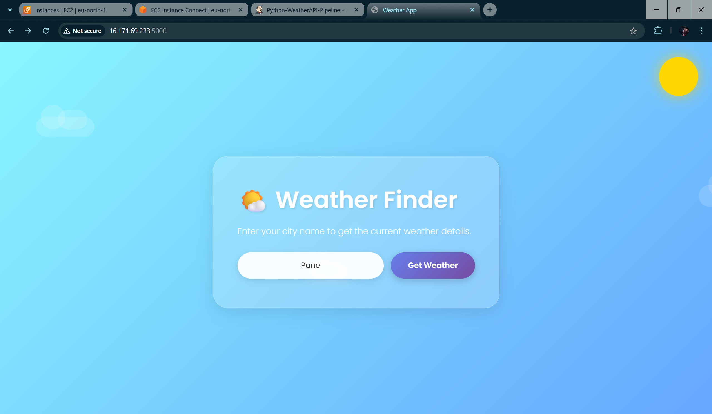
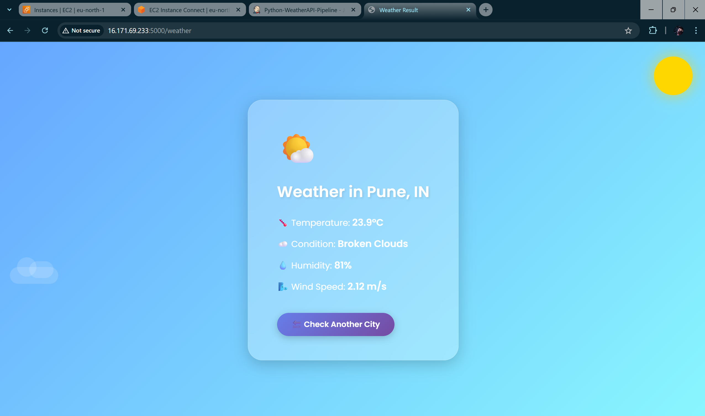
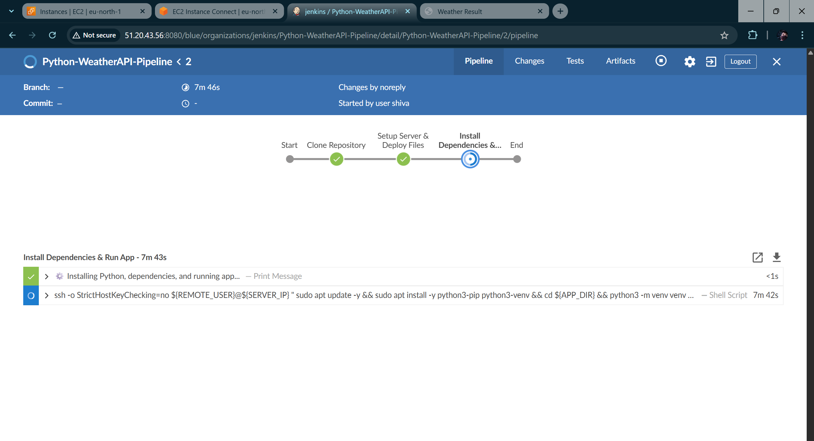

# 🌦️ Automated Flask Weather App Deployment using Jenkins Pipeline

> ☁️ This project demonstrates a **fully automated CI/CD Pipeline** that clones, sets up, and deploys a **Flask-based Weather Web Application** on a **Linux server** — powered by **Jenkins** and **GitHub Webhooks**.  
Whenever a new change is pushed to the GitHub repository, Jenkins rebuilds and redeploys the updated app automatically! 🚀
## 🧰 Tech Stack & Tools


---

## 🌐 Live Project Demo

🔗 **Deployed URL:** [http://your-server-ip:5000](http://13.49.80.18:5000)  
*(Flask app running on port **5000**) — showing **real-time weather details** based on the city name entered by the user.*

---



## 🌤️ Project Overview

This Flask application allows users to:
- Enter the **name of any city**
- Instantly get:
  - 🌡️ **Temperature**
  - 💧 **Humidity**
  - 🌬️ **Wind Speed**
  - 🌦️ **Sky Condition (Clear, Rainy, Cloudy, etc.)**
- Data fetched using an external **Weather API**

---

## 🧩 Project Workflow Summary

| 🧱 Step | ⚙️ Description | 🧰 Tools/Technologies |
|:--------|:---------------|:--------------------|
| **1️⃣ Create Jenkinsfile** | Define pipeline stages – clone, install dependencies, set up environment, and deploy Flask app. | Jenkins, Groovy Script |
| **2️⃣ Clone Repository** | Pull the latest Flask project code from GitHub. | Git, Jenkins |
| **3️⃣ Set Up Environment** | Create a Python virtual environment and install dependencies via `requirements.txt`. | Python, venv, pip |
| **4️⃣ Run Flask App** | Start Flask app on port **5000** (via Gunicorn or directly using Flask). | Flask, Gunicorn |
| **5️⃣ Deploy on Server** | Deploy app on **Linux EC2 server** and ensure it’s running persistently. | Linux, Systemd |
| **6️⃣ Add Webhook** | Configure **GitHub → Jenkins Webhook** to trigger the pipeline on every new commit. | GitHub Webhooks |
| **7️⃣ Access App** | Access live weather web app via browser. | Web Browser |

---

# 🔧 Jenkins Job — Step-by-Step Setup (Pipeline from SCM)

Follow these steps to create your **Jenkins Pipeline Job** for the Flask Weather App deployment.

---

## 🧱 1️⃣ Create a New Jenkins Job

- In Jenkins, click **“New Item”**
- Enter **Job Name:** `flask-weather-pipeline-deploy`
- Select **Pipeline**
- Click **OK**

---

## 📝 2️⃣ General Configuration (Optional)

- **Description:**  
  `Automated Flask weather app deployment — clones repo, sets up Python environment, installs dependencies, and deploys Flask app automatically.`

---

## ⚙️ 3️⃣ Pipeline Definition (Important)

| Setting | Value |
|:--------|:------|
| **Definition** | `Pipeline script from SCM` |
| **SCM** | `Git` |
| **Repository URL** | `https://github.com/Shivamgarud8/weather-jenkins-python-pipeline.git` |
| **Credentials** | `- none -` *(if public)* or **add SSH key credentials** if private |
| **Branches to build (Branch Specifier)** | `*/main` *(or your default branch)* |
| **Script Path** | `Jenkinsfile` *(adjust if it’s inside a subfolder)* |

✅ **This makes Jenkins automatically fetch and execute your pipeline code.**

---

## 🔔 4️⃣ Build Triggers (Connect GitHub Webhook)

- Check ✅ **“GitHub hook trigger for GITScm polling”**

📌 Alternatively, use **Poll SCM** →  
Schedule: `H/5 * * * *` *(checks repo every 5 minutes — not needed if webhook is set).*

---

## 🚀 5️⃣ Save & Run the Pipeline

- Click **Save**
- Click **Build Now** to manually run the pipeline once
- On the next Git push, the pipeline will auto-trigger and redeploy the updated Flask app!

---

## ✅ Result

Every new commit will:

1. Automatically trigger Jenkins pipeline  
2. Clone latest Flask app from GitHub  
3. Create and activate a Python virtual environment  
4. Install dependencies from `requirements.txt`  
5. Start/restart Flask app on **port 5000**  
6. Make your app live instantly at `[Server-IP]:5000` 🌍  

---

## ⚠️ Note — Server Configuration

Before deploying, make sure:

- ✅ Python 3, `pip`, and `venv` are installed  
- ✅ Port **5000** is **open in your EC2 security group**  
- ✅ Jenkins has **SSH access** to the target server  
- ✅ All dependencies are listed correctly in `requirements.txt`  

To open port **5000** on AWS EC2:

```bash
sudo ufw allow 5000/tcp

```
---
👩‍🏫 **Guided and Supported by [Trupti Mane Ma’am](https://github.com/iamtruptimane)**  
---

👨‍💻 **Developed By:**  
**Shivam Garud**  
🧠 *DevOps & Cloud Enthusiast*  
💼 *Automating deployments, one pipeline at a time!*  
🌐 [GitHub Profile](https://github.com/Shivamgarud8)
🌐 [Medium blog](https://medium.com/@shivam.garud2011)
